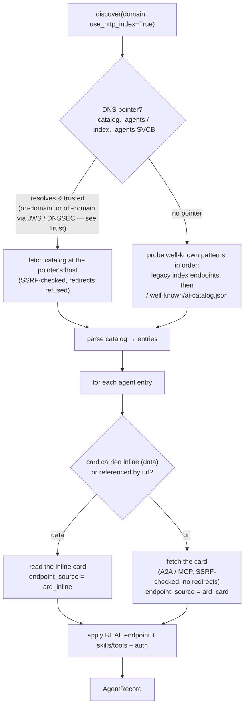
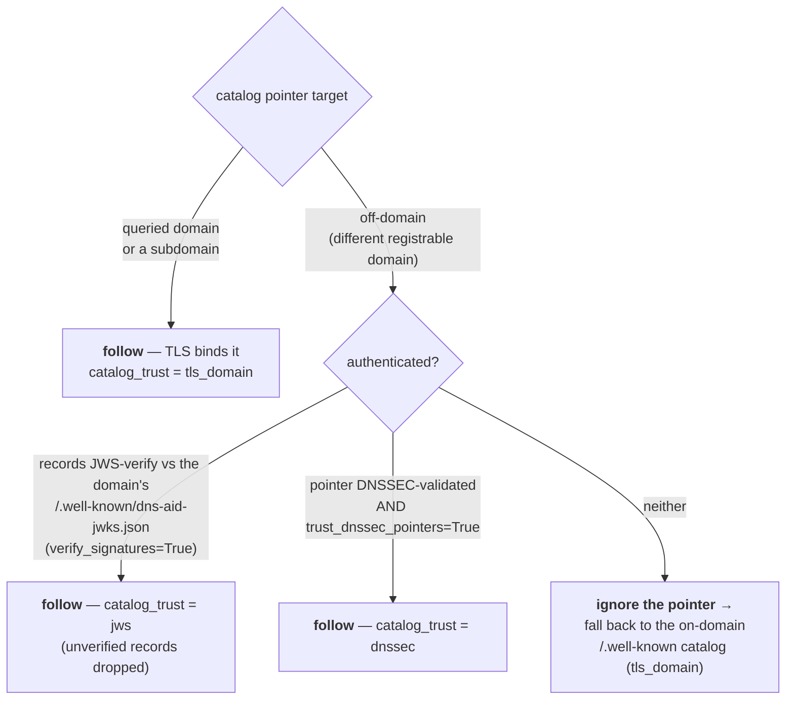

# ARD ai-catalog discovery

DNS-AID interoperates with [ARD (Agentic Resource Discovery)](https://agenticresourcediscovery.org/spec/):
a domain can publish its agents as an **ARD ai-catalog**, advertise *where* that
catalog lives in DNS, and DNS-AID discovers the agents — dereferencing each one
to its real service endpoint. ARD is the search/index layer; DNS-AID is the
authoritative-discovery + identity substrate underneath it (the ARD spec §6.1
names DNS SVCB for catalog discovery, and §7.2.1 names DNS-AID for authoritative
registries).

This is **fully opt-in and non-breaking**. A domain that publishes nothing new
behaves exactly as before; pure-DNS discovery never touches any of this.

## Discovery order of operations

`discover(domain, use_http_index=True)` resolves agents in this order. Pure DNS
discovery (`use_http_index=False`, the default) is a separate path that ignores
the catalog entirely.



Key invariants:

- **The identifier is a name, not a locator (ARD §4.2.1).** A catalog agent's
  endpoint comes from its card — read inline (`data`) or dereferenced (`url`) —
  never by turning the `urn:air:…` identifier into a DNS hostname. DNS-AID's
  authoritative per-agent DNS discovery is the *separate* pure-DNS plane
  (`discover(domain)` over SVCB records).
- **The pointer is authoritative for *location*.** Publishing a `_catalog._agents`
  / `_index._agents` SVCB tells discovery where the catalog is; without one,
  discovery falls back to the well-known path on the domain itself.
- **Nothing is fetched from a parse path.** URL-referenced nested catalogs are
  never followed; only agent cards are fetched, and only through the
  SSRF-validated, size-capped, redirect-refusing fetcher.

## Publishing the pointer (host-anywhere)

The catalog can live anywhere — the SVCB target is just a hostname:

```bash
# Dual-label by default: _catalog._agents (ARD) + _index._agents (DNS-AID)
dns-aid index publish-catalog example.com catalogue.example.com

# ARD label only (don't touch the DNS-AID org-index pointer)
dns-aid index publish-catalog example.com catalogue.example.com --catalog-only

# Fixed-IP origin: add RFC 9460 address hints (OMIT for CDN-fronted hosts)
dns-aid index publish-catalog example.com catalogue.example.com --ipv4-hint 203.0.113.10
```

produces:

```dns
_catalog._agents.example.com.  SVCB 1 catalogue.example.com. alpn="h2" port="443"
_index._agents.example.com.    SVCB 1 catalogue.example.com. alpn="h2" port="443"
```

The target host carries the public TLS cert and can hold a DANE/TLSA record
(draft-02 §Known Organization); pass `verify_dane=True` to bind each resolved
agent endpoint's certificate to that TLSA record (defense-in-depth, meaningful
only under DNSSEC — surfaced as `AgentRecord.dane_verified`). Any host works — a dedicated box, CloudFront,
an S3 REST endpoint, or a partner-hosted origin — as long as it serves the
catalog over HTTPS at `/.well-known/ai-catalog.json`.

Library and MCP equivalents: `dns_aid.core.catalog_pointer.publish_catalog_pointer(...)`
and the MCP `publish_catalog_pointer` tool.

#### Removing a catalog pointer

The inverse operation removes the pointer SVCB records — available on all three
interfaces, and idempotent (missing records are a no-op):

```bash
# Remove both _catalog._agents and _index._agents SVCB records
dns-aid index unpublish-catalog example.com

# Remove only the ARD _catalog._agents label (leave _index._agents in place)
dns-aid index unpublish-catalog example.com --catalog-only
```

Only the SVCB pointer is deleted — any TXT at `_index._agents` (a DNS-AID
org-index listing) is left intact. Library and MCP equivalents:
`dns_aid.core.catalog_pointer.unpublish_catalog_pointer(...)` and the MCP
`unpublish_catalog_pointer` tool.

### Compatibility

- **Pure-DNS discovery is untouched.** Publishing a pointer only affects
  `use_http_index=True` discovery.
- **`_index._agents` is protected.** If the domain already has an `_index._agents`
  SVCB pointing at a different host, publish preserves it and warns; pass
  `--force-index` to replace it, or `--catalog-only` to skip it.

## What discovery returns

For an ARD agent resolved from catalog data, the agent's card is fetched and
dereferenced, so you get the **real** service endpoint and the card's
skills/tools — not the catalog's card URL:

```bash
dns-aid discover example.com --use-http-index --json
```

```jsonc
{
  "name": "billing",
  "protocol": "mcp",
  "endpoint": "https://billing.example.com",   // real endpoint from the card
  "endpoint_source": "ard_card",
  "capabilities": ["create_invoice", "list_payments"],
  "capability_source": "agent_card",
  "catalog_trust": "tls_domain",               // how the catalog was trusted: tls_domain | dnssec | jws
  "trust_manifest": { "identity": "spiffe://example.com/agents/billing", "...": "..." }
}
```

## Trust

An ARD entry's `trustManifest` (publisher identity, SOC 2 / ISO 27001 / GDPR
attestations, provenance, signature) is preserved on `AgentRecord.trust_manifest`
as **pass-through published claims** — DNS-AID does not verify signatures,
digests, or identity in this release. Two warning-only signals flag possible
impersonation: `ard_trust_identity_mismatch` (identity domain ≠ URN publisher)
and `ard_trust_foreign_publisher` (URN publisher ≠ the host that actually served
the catalog over TLS).

### Catalog-pointer trust

The catalog's *location* is trusted by one of three anchors — **you only ever
need one, and DNSSEC is never required**. The basis is surfaced on every ARD
record as `catalog_trust` (SDK/CLI/MCP):



- **TLS-to-own-domain (default).** A catalog served on the queried domain (or a
  subdomain) — via the well-known path or an on-domain `_catalog._agents` /
  `_index._agents` pointer target — is bound to the domain by TLS.
  → `catalog_trust: "tls_domain"`.
- **DNSSEC (opt-in via `trust_dnssec_pointers=True`; CLI `--trust-dnssec-pointers`, MCP `trust_dnssec_pointers`).**
  An off-domain pointer is followed when its pointer record is DNSSEC-validated. Off
  by default — the AD flag is only trustworthy with a validating resolver over a secure path
  (localhost / DoT / DoH), so enable it only when you run one. →
  `catalog_trust: "dnssec"`.
- **JWS (optional).** With `verify_signatures=True`, an off-domain catalog whose
  records are JWS-signed against the queried domain's
  `/.well-known/dns-aid-jwks.json` is followed. → `catalog_trust: "jws"`.
  Records that fail verification are dropped automatically — an off-domain
  catalog has no other trust anchor.

An off-domain pointer that is **neither** DNSSEC-authenticated nor JWS-signed is
**ignored** — discovery falls back to the queried domain's own well-known
catalog. This prevents a spoofed or injected pointer from redirecting discovery
to a forged off-domain catalog.

Two fail-safe tradeoffs to know: an off-domain catalog that is authenticated but
*legitimately empty* can be shadowed by a stale on-domain well-known catalog (an
empty source never wins the fallback cascade); and a record listed inside an
off-domain JWS catalog that carries no signature of its own is dropped. Both are
stricter, never looser — they fail closed.
